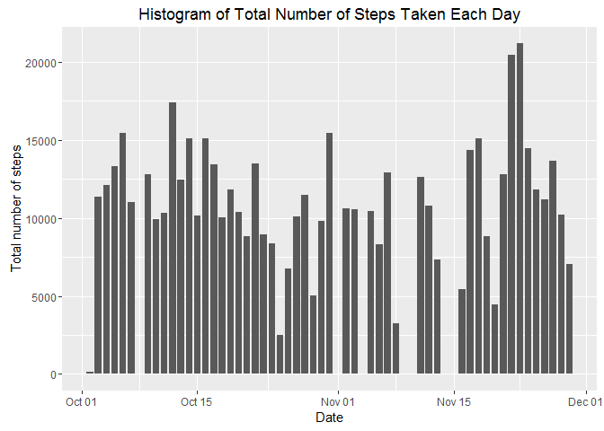
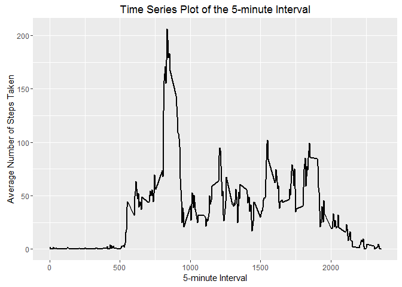
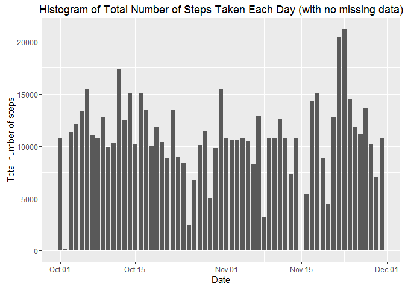

# Reproducible Research: Peer Assessment 1

## Basic Settings

```r
echo = TRUE
Sys.setlocale("LC_TIME", "UK")
```

```
## [1] "English_United Kingdom.1252"
```

## Loading and preprocessing the data

```r
unzip("activity.zip")
dat <- read.csv("activity.csv")
dat$date <- as.Date(dat$date)
noNA <- na.omit(dat)
library(ggplot2)
```

## What is mean total number of steps taken per day?

- Calculate the total number of steps taken per day

```r
stepsbyday <- with(noNA, tapply(steps, date, sum))
```

- Make a histogram of the total number of steps taken each day

```r
ggplot(noNA, aes(date, steps)) + 
        geom_bar(stat = "identity", width = 0.8) + 
        labs(title = "Histogram of Total Number of Steps Taken Each Day", x = "Date", 
             y = "Total number of steps")
```

<!-- -->

- Calculate and report the mean and median of the total number of steps taken per day
Mean total number of steps taken per day: 

```r
mean(stepsbyday)
```

```
## [1] 10766.19
```
Median total number of steps taken per day: 

```r
median(stepsbyday)
```

```
## [1] 10765
```

## What is the average daily activity pattern?

- Make a time series plot (i.e. type = "l") of the 5-minute interval (x-axis) and the average number of steps taken, averaged across all days (y-axis)

```r
stepsbyinv <- aggregate(noNA$steps, by = list(interval = noNA$interval), FUN = mean)
names(stepsbyinv)[2] <- "MeanOfSteps"
ggplot(stepsbyinv, aes(interval, MeanOfSteps)) + 
         geom_line(size = 0.8) + xlab("5-minute Interval") + 
         ylab ("Average Number of Steps Taken") + 
         ggtitle("Time Series Plot of the 5-minute Interval")
```

<!-- -->

- Which 5-minute interval, on average across all the days in the dataset, contains the maximum number of steps?

```r
stepsbyinv[stepsbyinv$MeanOfSteps == max(stepsbyinv$MeanOfSteps), ]
```

```
##     interval MeanOfSteps
## 104      835    206.1698
```

## Imputing missing values

- The total number of missing values in the dataset

```r
sum(is.na(dat))
```

```
## [1] 2304
```

- Devise a strategy for filling in all of the missing values in the dataset
Below is one solution that uses the mean of 5-minute interval to fill in NA values.

- Create a new dataset that is equal to the original dataset but with the missing data filled in

```r
repdat <- dat
for (i in 1:nrow(repdat)){
        if (is.na(repdat$steps[i] == TRUE)){
                repdat$steps[i] <- stepsbyinv[
                        which(repdat$interval[i] == stepsbyinv$interval), ]$MeanOfSteps
        }
}
sum(is.na(repdat))
```

```
## [1] 0
```

- Make a histogram of the total number of steps taken each day and Calculate and report the mean and median total number of steps taken per day

```r
ggplot(repdat, aes(date, steps)) + 
        geom_bar(stat = "identity", width = 0.8) + 
        labs(title = "Histogram of Total Number of Steps Taken Each Day (with no missing data)", x = "Date", y = "Total number of steps")
```

<!-- -->

- Do these values differ from the estimates from the first part of the assignment? What is the impact of imputing missing data on the estimates of the total daily number of steps?
Mean total number of steps taken per day: 

```r
stepsbydate <- aggregate(repdat$steps, list(date = repdat$date), FUN = "sum")
mean(stepsbydate$x)
```

```
## [1] 10766.19
```
Median total number of steps taken per day: 

```r
median(stepsbydate$x)
```

```
## [1] 10766.19
```
Compare them with statistics with missing data:
Difference of mean:

```r
mean(stepsbyday) - mean(stepsbydate$x)
```

```
## [1] 0
```
Difference of median:

```r
median(stepsbyday) - median(stepsbydate$x)
```

```
## [1] -1.188679
```
As the output is all 0, there's no difference after replacing the missing data. 

## Are there differences in activity patterns between weekdays and weekends?

- Create a new factor variable in the dataset with two levels – “weekday” and “weekend” indicating whether a given date is a weekday or weekend day. 

```r
weekday <- c("Monday", "Tuesday", "Wednesday", "Thursday", "Friday")
repdat$weekdays <- factor(ifelse(is.element(weekdays(as.Date(repdat$date)), 
                                            weekday), "weekday", "weekend"))
table(repdat$weekdays)
```

```
## 
## weekday weekend 
##   12960    4608
```

- Make a panel plot containing a time series plot (i.e. type = "l") of the 5-minute interval (x-axis) and the average number of steps taken, averaged across all weekday days or weekend days (y-axis).

```r
MeanOfSteps <- aggregate(formula = steps ~ interval + weekdays, 
                         data = repdat, FUN = mean)
names(MeanOfSteps)[3] <- "avgsteps"
library(lattice)
xyplot(avgsteps ~ interval | weekdays, 
       data = MeanOfSteps, layout = c(1, 2), type = "l", 
       xlab = "Interval", ylab = "Number of steps")
```

<!-- -->
